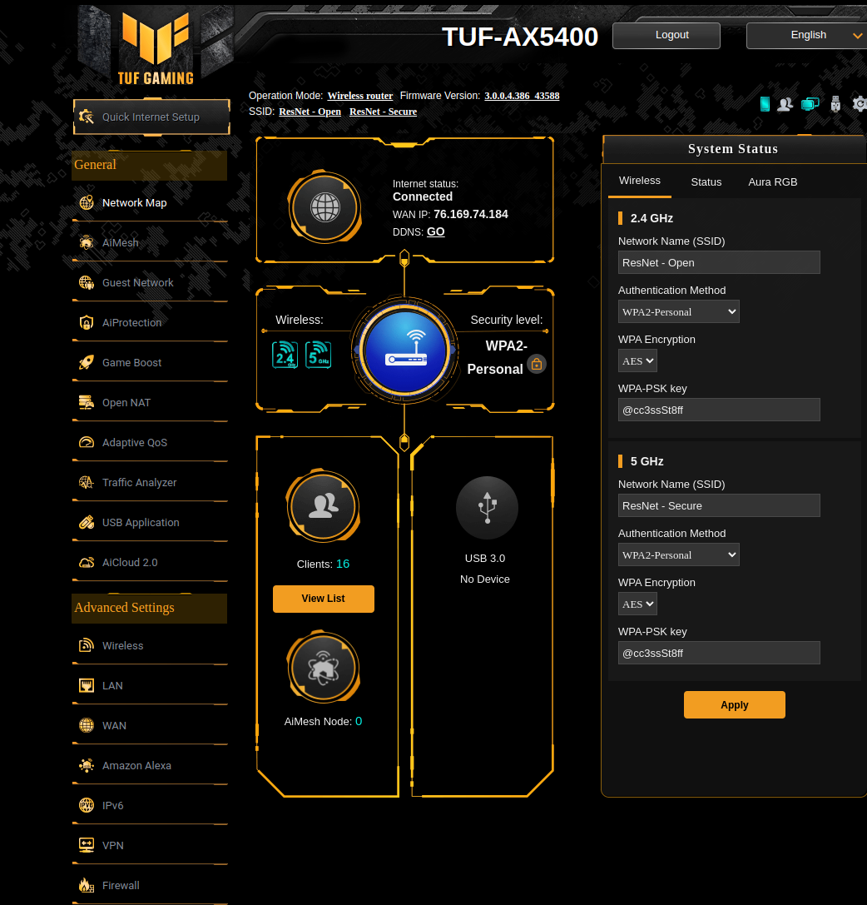
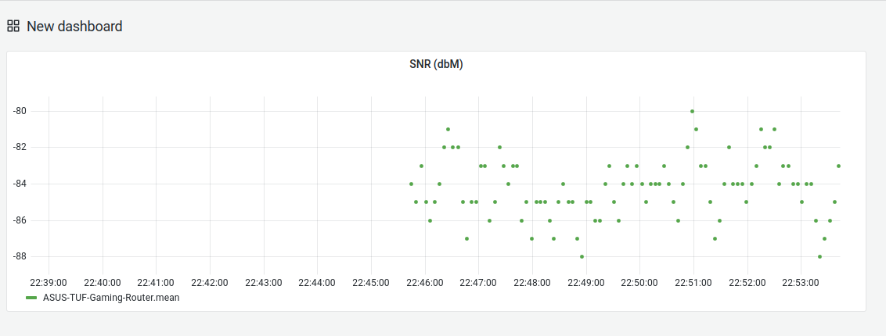
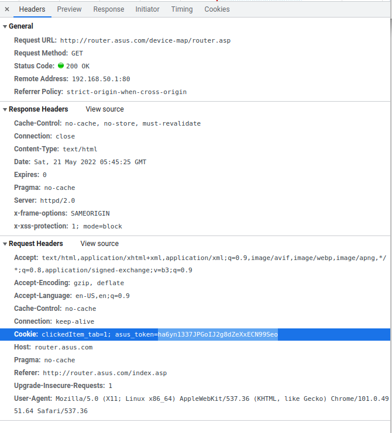

# About/Context

This is a very simple script for monitoring an [ASUS TUF Gaming AX5400 router](https://www.asus.com/Networking-IoT-Servers/WiFi-Routers/ASUS-Gaming-Routers/TUF-Gaming-AX5400/)(I know, the name sucks) via InfluxDB and Grafana.

Like most routers, this one has a "management portal" to allow you to view the current status of various functionality, but this portal is mostly limited in that it only shows you current information, and in a not-very-user-friendly way.



By exporting your data into InfluxDB instead, you'll be able to view your data in Grafana or any other InfluxDB-compatible viewer instead.

For example, here's my simple Grafana dashboard:




# Functionality
This project is a work-in-progress, so limited functionality is available.

| Feature | Implemented? |
| -----   | --------     |
| Wireless radio(s) noise level | Y |
| Traffic analysis | N |
| Connected MAC addresses | N |

# Detail

This Python script works by essentially scraping the router management portal for information, parsing it, and uploading it to InfluxDB.

# Setup/Usage

## Pre-requisites

You'll need to have Python installed, as well as InfluxDB setup and configured.


# Usage

Clone this repository, then log into the router's management portal. Open up the 'Developer Tools' in whichever browser you're using, and navigate to the Network section to see information about what requests are being made. Open up one of the requests, and examine it's cookies -- you should see a cookie called `asus_token`.



This is your current login cookie -- paste it into the field in the config.yml file.

Do the same for the "User Agent" field.

Next, make sure that the `influx_config.yml` port is set to whichever you have setup.

You can then simply run:

```bash
$ python3 main.py
```

to start collecting measurements. Measurements are collected every 5 seconds by default